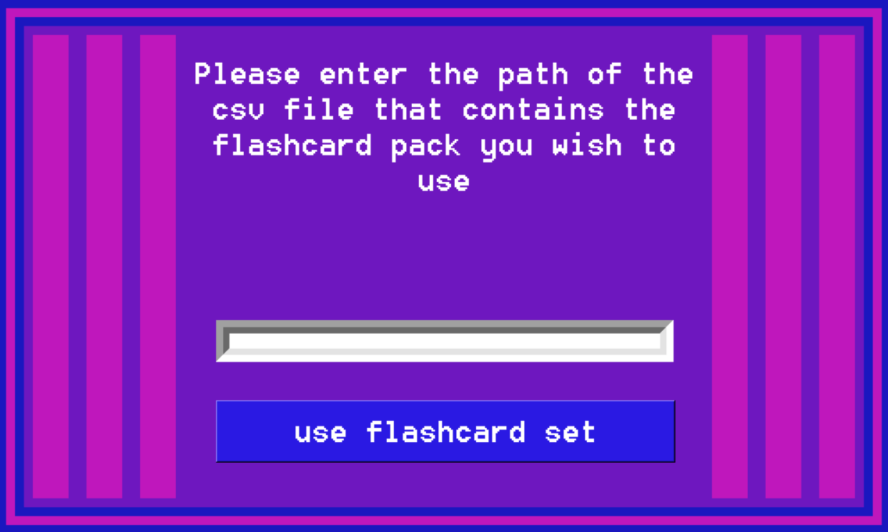
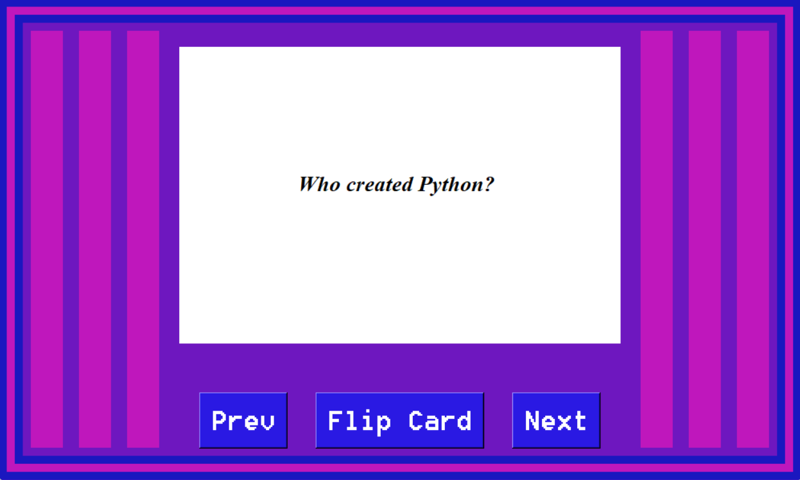

# Flashcard-Study-App

 A program that uses a .csv file to produce a set of flashcards that the user can flip through and study. 

## Table of Contents
- [About](#about)
- [Getting Started](#getting_started)
- [How to Use](#usage)
- [Authors](#authors)
## About 
This program was created in order to build up programming skill and also show my capability of reading in data from seperate files and use that data in my programs.
## Getting Started 
What you will need to run this program: 
- <em>Python</em>- To run this program, you must have some way to run a .py file. Also, this program was written using python 3.8.3, and has not been tested using any other version.
- <em>.csv file</em>- In order to create your own flashcard sets, you will have to be able to create and format a .csv file of your own so that the program can use the flashcard set you've created. The folder holding the .py program has an example .csv file whose format can be easily followed and copied. It is easiest to simply copy the .csv file given in the folder, and write your own questions and answers in.

## How to Use 
After installing and adding everything necessary, all you need to do is run the program, and enter the path of the .csv file you want to use as a flashcard set. Make sure when inputting the path of the flashcard set into the program, include the .csv. Also, to make things easier if you don't know how to get the path of the file, make sure the .csv file is in the same folder as the program, just like the example .csv file. Then you can just enter the name of the file in. For example, "Test.csv" would work as input if there was a file named that in the same folder as the program.

NOTE: Just like flashcards in real life, there's going to be a limit to how much you can write on a single side of a card. Be cautious when writing your flashcard set to not make quiestions or answers too long.

## Author 
[@AlexHettle](https://github.com/AlexHettle) - Sole author of project
