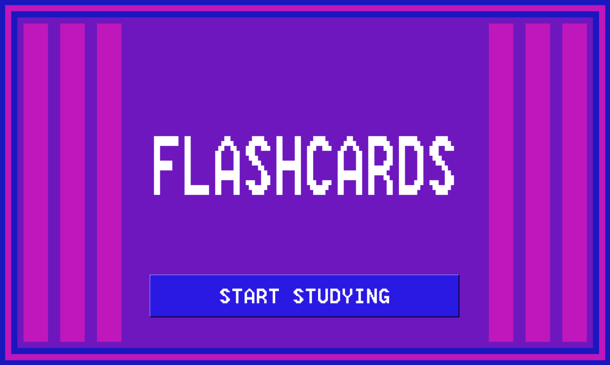

# Flashcard-Study-App

 A program that uses a .csv file to produce a set of flashcards that the user can flip through and study. 

## Table of Contents
- [About](#about)
- [Getting Started](#getting_started)
- [How to Use](#usage)
- [Authors](#authors)
## About 
This program was created in order to build up programming skill and also show my capability of reading in data from seperate files and use that data in my programs.This program was written over the span of a few days
## Getting Started 
What you will need to run this program: 
- <em>Python</em>- To run this program, you must have some way to run a .py file. Also, this program was written using python 3.8.3, and has not been tested using any previous version.
- <em>.csv file</em>- In order to create your own flashcard sets, you will have to be able to create and format a .csv file of your own so that the program can use the flashcard set you've created. The folder holding the .py program has an example .csv file whose format can be easily followed and copied. It is easiest to simpy copy the .csv file given in the folder, and write your own questions and answers in.
## How to Use 
After installing and adding everything necessary, all you need to do is run the program, and enter the name of the .csv file you want to use as a flashcard set. Make sure when inputting the name of the set into the program, include the .csv. Also, make sure the .csv file is in the same folder as the program, just like the example .csv file.
## Author 
[@AlexHettle](https://github.com/AlexHettle) - Sole author of project
